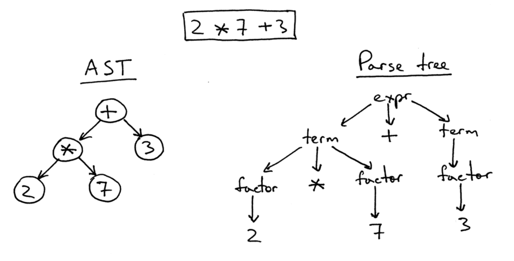

# Projeto de um Compilador

- Trabalhos 2 e 3 (T2-T3): Análise Sintática com Construção de AST. Construção de um analisador sintático bottom-up para B-lite que gera representação na forma de AST para programas válidos.

Nesta parte do projeto, você irá implementar um analisador sintático 
_bottom-up_ para a [linguagem B-lite](./B-lite) com
construção da árvore sintática abstrata (AST - Abstract Syntax Tree) para 
programas B-Lite corretos.
O trabalho T2-T3 inclui a implementação de um analisador sintático, construído com a ferramenta _Bison_, 
funções auxiliares para a construção da AST durante o processo de análise, 
uma função de _prettyprint_ para gerar uma representação externa para AST 
e o programa principal (detalhes a seguir).



O analisador sintático gerado pelo Bison, _yyparse()_, deve receber uma sequência de _tokens_ 
enviados pelo analisador léxico _yylex()_, e determinar se um programa B-Lite segue ou não a especificação definida por sua gramática.
Em caso de sucesso, 
o analisador sintático deve gerar uma AST para o programa de entrada analisado 
e disponibilizar uma referência para a raiz da AST construída, para ser usada pela função _printAST_ (fornecida no material).
Em caso de erro sintático detectado, 
apenas uma mensagem de erro deverá ser reportada e a análise sintática deve ser interrompida.

O código de funções auxiliares para a criação e manipulação da AST e
para a geração de uma representação usando a notação de 
_labelled bracketing_ para a AST retornada 
(explicada mais adiante) é fornecido pela professora.

Antes de iniciar a implementação do T2-T3 em equipe, 
recomendamos a leitura dos capítulos 5 e 6 do livro 
"Introduction to Compilers and Language Design" de Douglas Thain.
Apesar da sintaxe de B-lite ser um pouco diferente da usada no livro de Thain, 
os exemplos de código e o material são úteis.
Recomendamos fortemente que os exercícios E2, E7 e E8 sejam resolvidos antes de começar o trabalho T2-T3.

## Analisador sintático em Bison

O analisador sintático para B-lite deverá ser desenvolvido com Bison, 
com base na [especificação sintática](./blite/MANUAL.md) da linguagem
e integrado com o analisador léxico 
desenvolvido com Flex no T1. O código do blite.l (T1) deverá ser usado
como ponto de partida para T2-T3, com as seguintes alterações:

- Indicar tokens mais específicos, por exemplo, TOKEN_IF ou TOKEN_WHILE, ao invés de "KEY", ou TOKEN_PLUS, TOKEN_MULT, etc., ao invés de "SYM";
- Calcular o valor das constantes literais, por exemplo, NUMBER (tipo integer) com valor atribuído a yylval;

### Notação para a Árvore Sintática Abstrata (Abstract Syntax Tree - AST)

Há diversas formas para representar árvores sintáticas corretas geradas para um programa sintaticamente válido.
Em nosso projeto de compilador, é importante definir e usar um formato único para representar
a AST, que seja independente de qualquer linguagem específica, seja fonte ou objeto.

Em nosso compilador, 
o analisador sintático construirá uma AST para programas sem erros léxicos e sem erros sintáticos.
O trabalho T2-T3 deve incluir uma função _main_ para chamar a função _yyparse()_ gerada pelo Bison. 
Para mostrar a AST criada, 
a função _main_ deve chamar a função _printAST_, tendo como argumento a raiz da AST,
para percorrer e gerar uma representação da AST
na notação de _labelled bracketing_.

## Notação para representar AST

A notação de _labelled bracketing_
define listas aninhadas de _prefix expressions_ (operadores antes dos operandos), 
usando colchetes para organizá-las. Ela será usada para representar ASTs.

Por exemplo, a expressão ``` 2 * 7 + 3``` mostrada acima,
é representada como ```[+ [* [2] [7]] [3]]``` na notação de _labelled bracketing_.

Cada número inteiro NUMBER, é representado como ```[NUMBER]```, por exemplo, ```[2] e [7]```,
e a operação de multiplicação entre dois números, como ```[* [2] [7]]```.

__Formato Geral__:
```
[operator [operand1] ... [operandN]]
```

Recursivamente, cada operando pode conter outra operação, por exemplo,
```
[op1 [op2 [a] [b]] [c]]
```
onde o operador ```op1``` possui os operandos ```[op2 [a] [b]]``` e ```[c]```,
e o operador ```op2``` tem como operandos ```[a]``` e ```[b]```.

Assim, a AST para a expressão ``` 2 * 7 + 3```
deve ser representada como ```[+ [* [2] [7]] [3]]``` na notação de _labelled bracketing_.


### Listas de nós que podem ser mostrados na AST

Tipos de nós que podem aparecem em uma AST e seus nomes correspondentes,
que deverão ser produzidos pelo seu analisador sintático:

```[program  ... ]```

* ```[var-declaration  ... ]```
   * [int]                ---> nome do tipo
   * [ID]                 ---> nome de variável

* ```[var-declaration  ... ]```  ---> com inicialização

   * [int]                ---> nome do tipo
   * [ID]                 ---> nome de variável
   * [valor]              ---> valor de um literal 

IMPORTANTE: o símbolo de barra invertida (backslash \) é usado para não interpretar [ ou ] como nós de colchetes, e sim para serem símbolos visíveis na AST.

* ```[fun-declaration  ... ]```

   * [type] / [void]       ---> o nome do tipo retornado ou uso de void
   * [ID]                 ---> nome de função
   * [params  ...  ]      ---> gerar apenas [params], se não houver parâmetros na função
      * [param  ... ]     ---> (opcional) informação sobre parâmetro
         * [int]           ---> o tipo int
         * [ID]                 ---> nome de variável
   * ```[compound-stmt  ... ]```     ---> (opções de filhos abaixo)

####  Comandos compostos

* ```[;]```                       ---> comando vazio

* ```[selection-stmt ... ]```     ---> ou comando IF
   * ver EXPRESSION             ---> definição recursiva de qualquer expressão válida
   * [compound-stmt  ...]       --> ramo "then" (true)
   * [compound-stmt  ... ]      --> (opcional) ramo "else" (false)

* ```[iteration-stmt  ... ]```  --> apenas "while"
   * ver EXPRESSION              --> definição recursiva de qualquer expressão válida
   * [compound-stmt ... ]        --> bloco de comandos do while (statements)

* ```[return-stmt ... ]```
      * ver EXPRESSION           --> definição recursiva de qualquer expressão válida

* ```[print-stmt ...]```         ---> ver lista de argumentos

* ```expression```


#### Expressões

* ```[OP ... ]```              --> operadores de expressão binária
  ```OP pode ser: +, -, *, /, <, <=, >, >=, ==, !=, =```

* ```[var  ... ]```      ---> uso de variável
   * [ID]
   * [NUM]             ---> uso de valor (literal) do tipo integer

* ```[call  ... ]```      ---> chamada (call) de função
   * [ID]
   * [args ... ]         ---> argumentos de função

* ```[OP ... ]```        ---> expressão binária ou unária


## Bison e Flex

O Bison deverá ser utilizado para geração do analisador sintático,
trabalhando em conjunto com o analisador léxico modificado.
- Os tokens são definidos no arquivo _blite.y_, usando a diretiva ```%token```.

```$ bison -d blite.y```
```$ flex blite.l```

Por fim, 
compilar e gerar o executável chamado de _blite_. 
As funções para criação e manipulação da AST estão nos arquivos _ast.c_ e _ast.h_.
A função _main_ chama a função _printAST_
para geração de saída no formato _labelled bracket_.
A função _main_ está definida em um arquivo C chamado de _main.c_.

O arquivo _makefile_ contém instruções para compilar os arquivos 
e gerar o executável _blite_. Para limpar os arquivos temporários,
use o comando ```make clean```.

### Como executar o analisador sintático

A função _main_  chama a função _yyparse()_ que, em caso de sucesso,
coloca o endereço da raiz da AST na variável _parser_result_, 
e chama a função _printAST_  para gerar a representação da AST 
na notação _labelled bracket_.
Em caso de erro sintático identificado, 
o mesmo será reportado e a análise interrompida, sem geração de AST.

```$ ./blite nome.bm nome.out```, 
sendo que o arquivo _nome.bm_ contém o programa-fonte em B-lite 
e _nome.out_ contém a AST para o programa-fonte 
representada na notação _labelled bracket_.

## Exemplo 1 
### Arquivo de entrada exemplo.bm
(programa sintaticamente correto.)

```
z: boolean;

foo: integer (x: integer, y:integer) = {
    z = false;
    t = y;
    y = x * y + 2;

    if (y == 0){
        z = true;
        y = t;
    }
    return y;
}

main: void () = {
   a: integer;
   b: integer;
   g: integer = 1;
   while (g < 10) do {
       read a,b;
       print foo(a, b);
       g = g + 1;
   }
}
```

### Saída após análise sintática do programa _exemplo.bm_

Importante: Caracteres de espacejamento serão ignorados na correção automática.

```
[program
  [var_declaration [boolean] [z]]
  [fun-declaration
    [int]
    [foo]
    [params
      [param [int] [x]]
      [param [int] [y]]
      [param [int] [z] [\[\]]]
    ]
    [compound-stmt
      [= [var [z] [0]] [0]]
      [= [var [y]]
        [+
          [* [var [x]] [var [y]]] [2]]]
      [selection-stmt
        [== [var [y]] [0]]
        [compound-stmt
          [= [var [y]] [1]]
        ]
      ]
      [return-stmt [var [y]]]
    ]
  ]

  [fun-declaration
    [void]
    [main]
    [params]
    [compound-stmt
      [var-declaration [int] [a] [10]]
      [iteration-stmt
        [< [var [g]] [10]]
        [compound-stmt
          [= [var [g]]
            [call
              [foo]
              [args [var [g]] [2] [var [a]]]
            ]]
          [;]
        ]
      ]
    ]
  ]


]
```
### Ilustração de AST gerada com a ferramenta 
[RSyntaxTree](https://yohasebe.com/rsyntaxtree/)


## Outro Exemplo
### Entrada 

```
min: integer;
color: integer;
main: void () {
   min = 1;
   color = 0; // red
}
```

### Saída

```
[program
  [var-declaration [integer][min]]
  [var-declaration [integer][color]]
  [fun-declaration
    [void]
    [main]
    [params]
    [compound-stmt
       [= [var [min]] [1]]
       [= [var [color]] [0]]
     ]
   ]
]
```

## Correção Automática

A correção automática do trabalho T2 será feita com o apoio de _scripts_.
Desse modo, a correção irá considerar apenas os arquivos colocados 
no repositório GitHub da equipe,
com os nomes de arquivos indicados na especificação do trabalho.

## Outras Referências

Uma consulta interessante é uma [especificação yacc para ANSI C](https://www.lysator.liu.se/c/ANSI-C-grammar-y.html)
feita no século passado (década de 80).

--------
Parte deste material foi traduzido pela Prof. Christina von Flach a partir do livro de Douglas Thain e notas de aula do Prof. Vinicius Petrucci.

<!-- https://ruslanspivak.com/lsbasi-part1/ -->
<!-- https://stackoverflow.com/questions/52563185/does-c-add-0-when-you-pass-a-literal-string-as-an-argument-in-a-function -->
